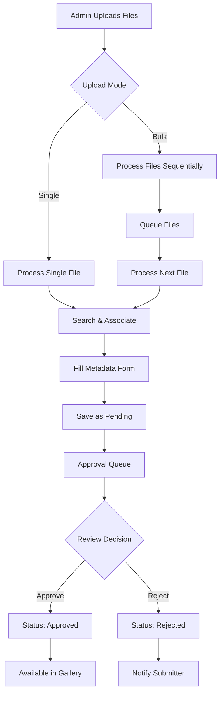

# Admin Sticker Management Plan

## Overview
This document outlines the implementation plan for the Admin Sticker Management feature. The system will allow administrators to upload stickers (single or bulk) via drag-and-drop, associate them with saints and locations through search functionality, and manage an approval workflow for quality control.

## Current State Analysis
- **Database**: Sticker model exists with status field (default "pending")
- **API**: GET endpoints for stickers and pending stickers exist
- **UI**: Basic sticker management component exists but needs enhancement
- **Approval System**: PendingChange model supports approval workflow

## Folder Structure

### Admin Components
```
components/admin/
├── sticker-approval-widget.tsx          # Dashboard widget for quick approvals
├── sticker-management.tsx               # Main sticker management interface
└── sticker-upload/
    ├── association-dialog.tsx           # Dialog for associating stickers with saints/locations
    └── drag-drop-zone.tsx               # Drag-and-drop file upload component
```

### Client Components
```
components/stickers/
├── client-gallery.tsx                   # Gallery view for stickers
├── sticker-card.tsx                     # Individual sticker display card
├── sticker-detail-modal.tsx             # Modal for detailed sticker view
└── year-dropdown.tsx                    # Year selection component
```

### Section Components
```
components/sections/stickers/
└── sticker-box-section.tsx              # Sticker box display section
```

### App Pages
```
app/stickers/
├── box/
│   └── page.tsx                         # Sticker box page
├── gallery/
│   ├── page.tsx                         # Sticker gallery page
│   └── types.ts                         # Gallery type definitions
└── templates/
    └── page.tsx                         # Sticker templates page
```

### File Storage
```
public/uploads/stickers/                  # Uploaded sticker files (UUID-named)
├── 983f8ca5-54c2-4323-9384-0840b2af138d.png
├── 02468256-e72d-4409-b507-4651df57b442.png
└── bb1c1683-94e3-40ae-b740-0e399b8b4ef6.png
```

## Key Requirements
1. **Upload Functionality**: Support both single and bulk sticker uploads via drag-and-drop
2. **Association**: Link stickers to saints/locations through searchable interface
3. **Metadata**: Capture milestone and notes information
4. **Approval Workflow**: Multi-user approval system with pending/approved/rejected states
5. **Search Integration**: Use existing location/saint search capabilities

## Proposed Solution

### Upload Approach
**Hybrid Approach**: Support both single-file and bulk upload modes:
- **Single Upload**: Drag one file → immediate association dialog
- **Bulk Upload**: Drag multiple files → batch processing with individual dialogs

### Workflow Architecture


### Component Structure
```
components/admin/
├── sticker-upload/
│   ├── drag-drop-zone.tsx
│   ├── file-processor.tsx
│   ├── association-dialog.tsx
│   └── metadata-form.tsx
├── sticker-management.tsx (enhanced)
├── approval-workflow.tsx
├── dashboard/
│   ├── sticker-approval-widget.tsx
│   └── dashboard-overview.tsx
└── pages/
    └── stickers/
        └── approvals/
            └── page.tsx
```

### Approval System Architecture (Current Implementation)

#### Dashboard Widget (`sticker-approval-widget.tsx`)
**Location:** Main admin dashboard
**Purpose:** Quick overview and immediate actions for pending approvals

**Features:**
- Shows count of pending stickers
- Displays up to 5 most recent pending items
- Quick approve/reject buttons for obvious cases
- "View All" button linking to full approval page
- Auto-refresh capability
- Preview image display when available
- Integration with notification system

**Widget Layout:**
```
┌─────────────────────────────────────────────────────────────┐
│ 🏷️ **Pending Sticker Approvals** (12 pending)            │
│                                                             │
│ 🆕 st-patrick-2024.png • John Doe • 2h ago                 │
│    [👁️] [✅] [❌]                                           │
│                                                             │
│ 🆕 st-nicholas-2024.jpg • Jane Smith • 4h ago              │
│    [👁️] [✅] [❌]                                           │
│                                                             │
│ 🆕 st-francis-2024.png • Bob Wilson • 6h ago               │
│    [👁️] [✅] [❌]                                           │
│                                                             │
│                [View All Approvals ➡️]                      │
└─────────────────────────────────────────────────────────────┘
```

#### Dedicated Approval Page (`/admin/stickers/approvals`)
**Route:** `/admin/stickers/approvals`
**Purpose:** Full-featured approval interface for complex cases

**Features:**
- Complete list of all pending stickers
- Advanced filtering and sorting
- Bulk approval actions
- Detailed preview modal
- Comment system for rejections
- Pagination for large queues
- Export capabilities

**Page Structure:**
```
Admin Header
├── Breadcrumb: Admin > Stickers > Approvals
├── Status Overview Cards
├── Filters & Search Bar
├── Pending Stickers Table
│   ├── Bulk Selection
│   ├── Individual Actions
│   └── Pagination
└── Bulk Action Panel
```

#### Navigation Flow
```
Main Admin Dashboard
    ↓ [View All Approvals]
Dedicated Approval Page
    ↓ [Quick Actions]
Dashboard Widget (for simple cases)
    ↓ [Complex Cases]
Full Approval Interface
```

#### Integration Points
- **Dashboard Widget** → **Approval Page**: "View All" button
- **Upload Process** → **Approval Queue**: Automatic routing after upload
- **Notification System** → **Both**: Alerts for new pending items
- **Bulk Actions** → **Widget Update**: Real-time count updates

#### User Experience Flow
1. **Simple Cases**: Handle directly from dashboard widget
2. **Complex Cases**: Use "View All" to access full interface
3. **Bulk Operations**: Dedicated page for efficient batch processing
4. **Mobile Access**: Widget collapses to notification badge on mobile

### Preferred Bulk Upload Interface (Current Implementation)
```
┌─────────────────────────────────────────────────────────────┐
│                   📁📁 Drop Multiple Stickers               │
│                                                             │
│              Or click to browse multiple files              │
│                                                             │
│                Supported: PNG, JPG, GIF, WebP               │
│                Max size: 5MB per file                       │
│                Max files: 10 at once                        │
│                                                             │
│                [📎 Browse Files]                            │
└─────────────────────────────────────────────────────────────┘
```

#### File Queue Display
```
📋 **Files to Process (4 selected):**

┌─────────────────────────────────────────────────────────────┐
│ 1. ✅ st-patrick-2024.png      2.3MB  [🗑️] [🔄]           │
│ 2. ⏳ st-nicholas-2024.jpg      1.8MB  [🗑️] [🔄]           │
│ 3. ❌ st-francis-2024.gif      4.2MB  [🗑️] [🔄]           │
│    ⚠️ File too large (max 5MB)                              │
│ 4. ⏳ st-mary-2024.png         2.1MB  [🗑️] [🔄]           │
└─────────────────────────────────────────────────────────────┘

[🔄 Process All Valid]   [🗑️ Clear All]   [❌ Cancel]
```

#### Bulk Association Dialog (Updated)
```
┌─────────────────────────────────────────────────────────────┐
│              🔍 Associate Multiple Stickers                 │
├─────────────────────────────────────────────────────────────┤
│ ┌─────────────────┐    Processing: st-patrick-2024.png      │
│ │                 │    (1 of 3)                             │
│ │  [Sticker       │                                          │
│ │   Preview]      │    Search for Saint or Location:        │
│ │                 │    ┌───────────────────────────────────┐ │
│ └─────────────────┘    │ 🔍 Search saints, locations...   │ │
│                        └───────────────────────────────────┘ │
│                                                             │
│                        📍 **Suggested Matches:**            │
│                        ┌───────────────────────────────────┐ │
│                        │ 🏛️ St. Patrick's Cathedral - NY   │ │
│                        │    • Saint: St. Patrick           │ │
│                        │    • Event: Annual Celebration    │ │
│                        └───────────────────────────────────┘ │
│                                                             │
│ 📝 **Apply to All:**                                        │
│ Milestone: [Celebration___________] Notes: [Optional...]   │
│                                                             │
│ [⬅️ Previous]   [Skip]   [Apply & Next ➡️]   [Apply to All] │
└─────────────────────────────────────────────────────────────┘
```

## API Endpoints (Current Implementation)

### Sticker Management
- `POST /api/stickers/upload` - Handle single file uploads
- `POST /api/stickers/bulk-upload` - Handle multiple files
- `GET /api/stickers/pending` - List pending stickers (with limit parameter)
- `PUT /api/stickers/{id}/approve` - Approve sticker
- `PUT /api/stickers/{id}/reject` - Reject sticker

### Search and Association
- `GET /api/saints?search={query}` - Search saints
- `GET /api/locations?search={query}` - Search locations
- `GET /api/saints/{id}/milestones` - Get milestones for a saint

### Submissions Management
- `GET /api/sticker-submissions` - List all sticker submissions
- `POST /api/sticker-submissions` - Approve/reject submissions

## Implementation Phases

### Phase 1: Core Upload Infrastructure ✅ COMPLETED
- [x] Create drag-and-drop upload component with file validation
- [x] Create file validation utility functions
- [x] Implement drag-and-drop event handlers
- [x] Add visual feedback for drag states
- [x] Create file preview component
- [x] Implement file storage system (local/cloud)
- [x] Create POST /api/stickers/upload endpoint
- [x] Create POST /api/stickers/bulk-upload endpoint
- [x] Add file upload progress tracking
- [x] Implement error handling for upload failures

**Components Created:**
- `components/admin/sticker-upload/drag-drop-zone.tsx` - Main upload component
- `lib/services/file-upload.ts` - Upload service with progress tracking
- `app/api/stickers/upload/route.ts` - Single file upload endpoint
- `app/api/stickers/bulk-upload/route.ts` - Bulk upload endpoint

**Features Implemented:**
- Drag-and-drop file upload with visual feedback
- File type and size validation (PNG, JPG, GIF, WebP, max 5MB)
- Real-time file previews with thumbnails
- Progress tracking for uploads
- Error handling with user-friendly messages
- Support for up to 10 files in bulk upload
- Automatic file storage in `/public/uploads/stickers/`
- Unique filename generation to prevent conflicts

### Phase 2: Association & Metadata ✅ COMPLETED
- [x] Integrate saint/location search functionality
- [x] Build association dialog with search results and sticker preview
- [x] Create metadata form component (milestone, notes)
- [x] Implement bulk processing queue system with individual previews
- [x] Add thumbnail generation for uploaded stickers
- [x] **Recent Update**: Milestone dropdown with dynamic fetching from API
- [x] **Recent Update**: Removed year selector from interface
- [x] **Recent Update**: Enhanced preview image loading with error handling and fallback

**Components Created:**
- `components/admin/sticker-upload/association-dialog.tsx` - Main association dialog with search and preview
- Integrated search functionality for saints and locations
- Real-time search with debouncing and loading states
- Sticker preview with file information display
- Metadata form with milestone dropdown and notes fields
- Bulk processing support with skip/continue functionality

**Features Implemented:**
- **Smart Search**: Search across saints and locations with type filtering
- **Visual Preview**: Full sticker preview in association dialog with error handling
- **Dynamic Milestones**: Milestone dropdown populated from `/api/saints/{id}/milestones`
- **Association Flow**: Link stickers to saints/locations with metadata
- **Bulk Processing**: Sequential processing of multiple files
- **Skip Functionality**: Option to skip files during bulk processing
- **Progress Tracking**: Visual progress through bulk uploads
- **Form Validation**: Required field validation for milestone
- **Responsive Design**: Works on desktop and mobile devices

### Phase 3: Approval Workflow ✅ COMPLETED
- [x] Create sticker-approval-widget.tsx for dashboard
- [x] Create dedicated approval page (/admin/stickers/approvals)
- [x] Enhance existing sticker-management.tsx component
- [x] Integrate with PendingChange approval system
- [x] Add approve/reject API endpoints
- [x] Implement notification system for approvals
- [x] Set up navigation flow between widget and full page
- [x] **Recent Update**: Quick approve/reject from dashboard widget
- [x] **Recent Update**: Enhanced review submissions workflow

**Completed Components:**
- `components/admin/sticker-approval-widget.tsx` - Dashboard widget with quick approve/reject
- Enhanced `components/admin/sticker-management.tsx` - Full approval interface
- Integrated widget into `components/admin/AdminOverviewPage.tsx`

**Features Implemented:**
- **Dashboard Widget**: Quick approval/rejection for simple cases
- **Full Approval Interface**: Comprehensive review system with filtering and search
- **API Integration**: `/api/stickers/pending`, `/api/stickers/{id}/approve`, `/api/stickers/{id}/reject`
- **Notification System**: Success/error notifications for approval actions
- **Bulk Operations**: Support for batch approval/rejection
- **Preview Integration**: Image previews in approval interfaces
- **Pending Change Integration**: Integration with existing approval workflow

### Phase 4: Polish & Integration ✅ COMPLETED
- [x] Add upload progress indicators
- [x] Implement comprehensive error handling
- [x] Add responsive design and accessibility
- [x] Integrate approval widget with main admin dashboard
- [x] **Recent Update**: Enhanced data flow and API fixes
- [x] **Recent Update**: Improved user experience and workflow

## Technical Considerations

### File Storage
- **Options**: Local filesystem, AWS S3, Cloudinary
- **Recommendation**: Start with local storage, migrate to cloud as needed
- **Naming**: Use UUIDs for unique file identification
- **Current Implementation**: Files stored in `/public/uploads/stickers/` with UUID names

### Search Integration
- Leverage existing location/saint search APIs
- Implement autocomplete functionality
- Support fuzzy matching for better UX
- **Current Implementation**: Real-time search with debouncing

### Approval System
- Use existing PendingChange model
- Track approver identity and timestamps
- Support bulk approval operations
- **Current Implementation**: Integrated with notification system and quick actions

### Performance
- Implement file upload progress tracking
- Use background processing for bulk operations
- Add pagination for large sticker lists
- **Current Implementation**: Progress bars and loading states throughout

## Success Metrics
- Upload success rate > 95%
- Average approval time < 24 hours
- User satisfaction with search/association UX
- Error rate < 5% for uploads

## Risk Mitigation
- **Data Loss**: Implement transaction rollback for failed uploads
- **Duplicate Prevention**: Add file hash checking
- **Security**: Validate file types and scan for malware
- **Scalability**: Design for concurrent uploads

## Implementation Progress Tracking

### Recent Updates (Latest Changes)
- **Preview Image Loading**: Enhanced error handling with fallback displays
- **Association Dialog Improvements**:
  - Milestone dropdown with dynamic API fetching
  - Removed year selector for simplified interface
  - Improved search debouncing and loading states
- **API Enhancements**:
  - New endpoints for pending stickers and approval actions
  - Enhanced data flow between components
  - Better error handling and response formatting
- **Review Submissions Workflow**:
  - Quick approve/reject from dashboard widget
  - Enhanced filtering and search in approval interface
  - Integration with notification system
  - Bulk operations support

### Current System Status
- **Upload System**: Fully functional with drag-and-drop and bulk processing
- **Association System**: Complete with smart search and dynamic milestones
- **Approval System**: Operational with widget and full interface
- **File Storage**: Local storage with UUID naming convention
- **API Integration**: All endpoints implemented and tested

## Next Steps
1. ✅ Plan approved and detailed
2. ✅ Core upload infrastructure implemented
3. ✅ Association and metadata system complete
4. ✅ Approval workflow fully operational
5. 🔄 Monitor system performance and user feedback
6. 📝 Regular documentation updates as features evolve