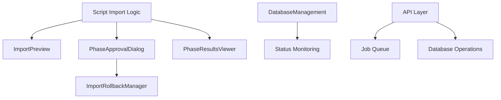

# Script-Based Import System Documentation

## Overview

The Import system provides script-based tools for administrators to manage data imports into the Saint Calendar application. The system focuses on automated processing with data validation, selective import capabilities, and rollback management.

### Key Features

- **Script-Based Processing**: Automated import scripts for efficient data processing
- **Data Preview**: Comprehensive preview of data before import with validation
- **Selective Import**: Granular control over which data types and locations to import
- **Error Handling**: Detailed error reporting and conflict resolution
- **Rollback Management**: Ability to undo imports with detailed impact analysis

## Script-Based Import Process

The import system now uses automated scripts to handle data imports. The process involves:

1. **Script Execution**: Running import scripts that handle data fetching, validation, and database insertion
2. **Data Validation**: Automatic validation of data integrity and conflict resolution
3. **Progress Monitoring**: Real-time status updates through job queues
4. **Error Handling**: Comprehensive error reporting and logging
5. **Rollback Support**: Ability to undo completed imports with impact analysis

Scripts can be executed manually or scheduled for recurring imports, providing flexibility for different use cases.

## Component Architecture

### Core Components

The import system consists of several interconnected components working together:

- **ImportPreview**: Data preview and selection interface
- **PhaseApprovalDialog**: User approval checkpoints during processing
- **PhaseResultsViewer**: Detailed results display for completed phases
- **ImportRollbackManager**: Rollback functionality with impact analysis
- **DatabaseManagement**: Database status monitoring

## Detailed Component Documentation

### ImportPreview Component

**File**: `components/admin/import-preview.tsx`

#### Purpose and Functionality

The ImportPreview component provides a comprehensive preview of data before import, allowing administrators to review and selectively import data. It validates data integrity, shows conflicts, and enables granular control over the import process.

#### Props

```typescript
interface ImportPreviewProps {
  onImportComplete?: (result: any) => void; // Callback when import completes
}
```

#### State Management

```typescript
interface ImportSelections {
  saints: boolean;              // Whether to import saint data
  historicalData: boolean;      // Whether to import historical records
  milestones: boolean;          // Whether to import milestone data
  locations: { [locationId: string]: boolean }; // Location-specific selections
}

const [previewData, setPreviewData] = useState<PreviewResult | null>(null);
const [selections, setSelections] = useState<ImportSelections>({...});
const [expandedLocations, setExpandedLocations] = useState<Set<string>>(new Set());
```

#### Key UI Elements and Interactions

1. **Initial Check Step**: Button to fetch and validate data
2. **Location Preview Grid**: Visual overview of all locations found
3. **Data Type Selection**: Checkboxes for saints, historical data, and milestones
4. **Location Selection**: Individual checkboxes with select/deselect all options
5. **Expandable Location Details**: Shows sample data, validation errors, and conflicts
6. **Conflict Resolution**: Options to skip, overwrite, or rename conflicting records
7. **Import Execution**: Final import button with progress tracking

#### Dependencies and Integration

- **API Endpoints**:
  - `POST /api/database/import/preview` - Fetch preview data
  - `POST /api/database/import` - Execute import
- **Libraries**:
  - `@/lib/key-validation` - Unique key validation
  - `@/lib/utils` - Utility functions
- **UI Components**: Card, Button, Checkbox, Badge, Label, Progress

#### Integration with Import Process

- **Phase**: Pre-import validation and selection
- **Triggers**: Script-based import processes
- **Outputs**: Selected data types and locations for import execution
- **Validation**: Saint number uniqueness, data integrity checks

### ImportRollbackManager Component

**File**: `components/admin/import-rollback-manager.tsx`

#### Purpose and Functionality

Provides a dialog interface for rolling back completed imports, showing detailed impact analysis and requiring user confirmation before proceeding with potentially destructive operations.

#### Props

```typescript
interface ImportRollbackManagerProps {
  isOpen: boolean;                          // Dialog visibility
  onClose: () => void;                      // Close dialog callback
  rollbackInfo: RollbackInfo | null;        // Rollback information
  onRollback: (workflowId: string) => Promise<void>; // Rollback execution
  isProcessing?: boolean;                   // Processing state
}
```

#### State Management

```typescript
const [currentStep, setCurrentStep] = useState<string | null>(null);
const [rollbackProgress, setRollbackProgress] = useState(0);
```

#### Key UI Elements and Interactions

1. **Rollback Overview**: Summary of affected records by type
2. **Estimated Duration**: Time estimate for rollback completion
3. **Rollback Steps**: Sequential steps with status indicators
4. **Warnings Display**: Important warnings about data loss
5. **Impact Summary**: Detailed explanation of rollback consequences
6. **Confirmation Buttons**: Cancel or confirm rollback action

#### Dependencies and Integration

- **Icons**: Lucide React icons (Undo2, CheckCircle, XCircle, etc.)
- **UI Components**: Dialog, Button, Badge, Alert, Card, Progress
- **Toast Notifications**: Sonner for user feedback


### PhaseApprovalDialog Component

**File**: `components/admin/phase-approval-dialog.tsx`

#### Purpose and Functionality

Modal dialog that appears between workflow phases to show results, gather user approval, and provide options to proceed, retry, or cancel the workflow.

#### Props

```typescript
interface PhaseApprovalDialogProps {
  isOpen: boolean;                    // Dialog visibility
  onClose: () => void;                // Close callback
  onApprove: () => void;              // Approval callback
  onReject: () => void;              // Rejection callback
  onRetry?: () => void;              // Retry callback
  phaseResult: PhaseResult | null;    // Phase results data
  isProcessing?: boolean;            // Processing state
}
```

#### Key UI Elements and Interactions

1. **Phase Status Alert**: Color-coded status with summary
2. **Phase-Specific Details**: Dynamic content based on phase type
3. **Data Visualizations**: Charts and graphs for count, verify phases
4. **Issues and Recommendations**: Lists of problems and suggestions
5. **Action Buttons**: Approve, reject, or retry options

#### Phase-Specific Features

- **Scan Phase**: Location count, validation status
- **Locations Phase**: New/changed/unchanged location breakdown
- **Verify Phase**: Tab validation with error details
- **Count Phase**: Record counts with data type distribution charts
- **Import Phase**: Success/failure counts with rollback availability

#### Dependencies and Integration

- **Charts**: Recharts for data visualization
- **Icons**: Lucide React and custom status icons
- **UI Components**: Dialog, Button, Badge, Alert, Card

### PhaseResultsViewer Component

**File**: `components/admin/phase-results-viewer.tsx`

#### Purpose and Functionality

Displays detailed results for completed workflow phases with expandable sections, logs, and error information.

#### Props

```typescript
interface PhaseResultsViewerProps {
  results: PhaseResultData[];    // Array of phase results
  className?: string;            // Additional CSS classes
}
```

#### State Management

```typescript
const [expandedPhases, setExpandedPhases] = useState<Set<string>>(new Set());
const [showLogs, setShowLogs] = useState<Set<string>>(new Set());
```

#### Key UI Elements and Interactions

1. **Phase Summary Cards**: Expandable cards for each phase
2. **Tabbed Content**: Summary, Details, Logs, Errors tabs
3. **Log Viewer**: Terminal-style log display with filtering
4. **Error Display**: Detailed error information with stack traces
5. **Data Overview**: JSON view of phase data

#### Dependencies and Integration

- **Icons**: Lucide React icons
- **UI Components**: Card, Badge, Button, Tabs, Alert


### DatabaseManagement Component

**File**: `components/admin/database-management.tsx`

#### Purpose and Functionality

Displays database status information including record counts, connection status, and location status distribution for monitoring import impact.

#### State Management

```typescript
const [databaseStatuses, setDatabaseStatuses] = useState<DatabaseStatus[]>([]);
const [locationStatuses, setLocationStatuses] = useState<LocationStatus[]>([]);
const [loading, setLoading] = useState(true);
const [error, setError] = useState<string | null>(null);
```

#### Key UI Elements and Interactions

1. **Database Status Cards**: Health status for Saints, Events, Locations tables
2. **Record Counts**: Current count of records in each table
3. **Last Updated**: Timestamp of last data modification
4. **Location Status Filter**: UI for filtering by Open/Pending/Closed status
5. **Status Distribution**: Visual breakdown of location statuses

#### Dependencies and Integration

- **API Endpoints**:
  - `GET /api/database/status` - Database status information
- **UI Components**: Badge, Button, Card

## API Integration

### Key API Endpoints

- **Job Management**:
  - `GET /api/jobs/[id]/status` - Get job status
  - `POST /api/jobs` - Job actions (cancel, retry)

- **Database Status**:
  - `GET /api/database/status` - Get database health and counts

## Usage Assumptions and Notes

### Prerequisites

1. **Authentication**: User must be signed in with appropriate admin permissions
2. **Database Connectivity**: Active database connection for import operations

### Performance Considerations

1. **Large Datasets**: Preview operations may take time for large datasets
2. **Network Timeout**: Long-running imports may require extended timeout settings
3. **Concurrent Imports**: System should prevent multiple simultaneous imports

### Error Handling

1. **Validation Errors**: Displayed prominently with actionable resolution steps
2. **Network Failures**: Automatic retry mechanisms with user notification
3. **Data Conflicts**: Clear options for skip, overwrite, or rename operations
4. **Rollback Safety**: Confirmation dialogs for destructive operations

### Accessibility Features

1. **Screen Reader Support**: ARIA labels and live regions for status updates
2. **Keyboard Navigation**: Full keyboard accessibility for all interactive elements
3. **High Contrast**: Proper color contrast ratios for all UI elements
4. **Focus Management**: Logical tab order and focus indicators

### Future Enhancements

1. **Bulk Operations**: Support for importing multiple data sources simultaneously
2. **Template Validation**: Pre-defined templates with validation rules
3. **Import Scheduling**: Automated recurring imports
4. **Advanced Filtering**: More granular data selection options
5. **Export Capabilities**: Ability to export import configurations and results

## Component Relationships



This documentation provides a comprehensive overview of the import system components, their functionality, and integration within the Saint Calendar application's script-based import system.