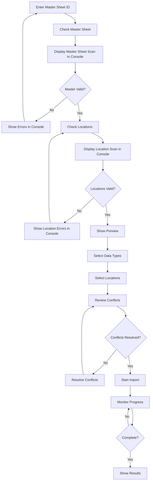
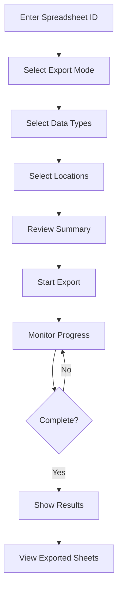
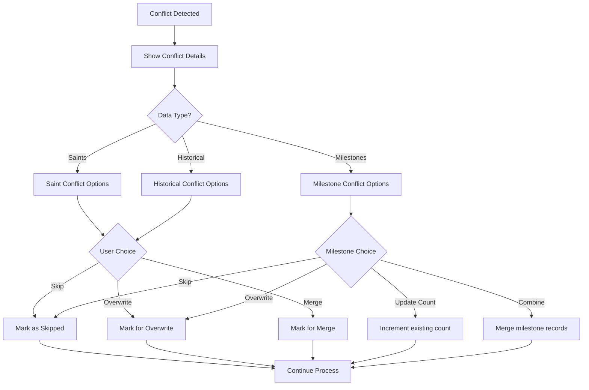

# Google Sheets Import/Export Section Mockups

## Overview

The Google Sheets Import/Export section provides administrators with a comprehensive interface for bidirectional data synchronization between the Saint Calendar database and Google Sheets. This feature enables bulk data operations, conflict resolution, and progress tracking for managing saints, historical data, and **milestone tracking** across multiple locations.

**Core Data Types:**
- **Saints**: Canonical saint records with feast dates and biographical information
- **Historical Data**: Location-specific events and historical records
- **Milestone Data**: Achievement tracking with fields for Saint Number, Count, Date, and Sticker

The new section integrates seamlessly with the existing database management interface, providing a unified workflow for data administrators to:
- Preview and validate data before import
- Select specific data types and locations for operations
- Monitor real-time progress during bulk operations
- Handle data conflicts and validation errors
- Export database content back to Google Sheets for external analysis

## Current System Analysis

The existing database management interface consists of a simple status dashboard displaying record counts and health indicators for Saints, Events, and Locations tables. The current system lacks:

- Bulk data import/export capabilities
- Data validation and conflict resolution
- Progress tracking for long-running operations
- Selective data type and location filtering
- Preview functionality before data operations

The new Google Sheets integration addresses these gaps by providing:
- Comprehensive import preview with data validation
- Selective import/export options by data type and location
- Real-time progress monitoring with detailed status updates
- Conflict detection and resolution strategies
- Error handling and recovery mechanisms

## Design Specifications

### 1. Overall Layout Integration

The Google Sheets Import/Export section integrates as a new subsection within the Database Management area. The layout follows the existing design system with:

- **Header Section**: Title, description, and action buttons
- **Main Content Area**: Tabbed interface for Import/Export operations
- **Status Panel**: Real-time progress and error display
- **Preview Area**: Expandable data preview with validation results

**Layout Structure:**
- **Spacing**: `gap-6` between major sections, `gap-4` between elements
- **Card Padding**: `p-6` for content, `px-6` for internal sections
- **Grid Systems**: Responsive grids (`grid-cols-1 md:grid-cols-2 lg:grid-cols-3`)
- **Form Layouts**: 2-column grids for form fields
```
┌─────────────────────────────────────────────────┐
│ Database Management > Google Sheets Sync       │
├─────────────────────────────────────────────────┤
│ [Import] [Export] [Settings]                   │
├─────────────────────────────────────────────────┤
│ ┌─ Import Section ──────────────────────────┐  │
│ │ Master Sheet ID: [input]                  │  │
│ │ [Check Master Sheet]                      │  │
│ │                                           │  │
│ │ ┌─ Data Types ──────────────────────────┐ │  │
│ │ │ ☑ Saint Data (1,234 records)        │ │  │
│ │ │ ☑ Historical Data (567 records)      │ │  │
│ │ │ ☑ Milestone Data (89 records)        │ │  │
│ │ └───────────────────────────────────────┘ │  │
│ │                                           │  │
│ │ ┌─ Locations ──────────────────────────┐ │  │
│ │ │ ☑ Select All / Deselect All          │ │  │
│ │ │ ☑ New York, NY (Active)              │ │  │
│ │ │ ☑ Boston, MA (Active)                │ │  │
│ │ │ ☐ Chicago, IL (Inactive)             │ │  │
│ │ └───────────────────────────────────────┘ │  │
│ │ [Check Locations]                        │  │
│ └─────────────────────────────────────────────┘
├─────────────────────────────────────────────────┤
│ ┌─ Console Output ──────────────────────────┐  │
│ │ Scanning master sheet...                  │  │
│ │ ✓ Master sheet structure valid            │  │
│ │ ✓ Found 15 locations                      │  │
│ │ Scanning locations...                     │  │
│ │ ⚠ Warning: Location 'Chicago' inactive   │  │
│ │ [Clear Console]                           │  │
│ └───────────────────────────────────────────┘  │
├─────────────────────────────────────────────────┤
│ ┌─ Progress & Status ───────────────────────┐  │
│ │ Importing saints... 45/123                │  │
│ │ [████████████████████████░░] 78%          │  │
│ └───────────────────────────────────────────┘  │
└─────────────────────────────────────────────────┘
```

### 2. Import Section Mockup

**Component Hierarchy:**
```
ImportPreview
├── Card (Master Sheet Input)
│   ├── CardHeader
│   │   ├── CardTitle: "Master Sheet Validation"
│   │   └── CardDescription: "Enter master sheet ID and validate structure"
│   └── CardContent
│       ├── Input: masterSheetId
│       └── Button: "Check Master Sheet"
├── Card (Console Output)
│   ├── CardHeader
│   │   ├── CardTitle: "Scan Results"
│   │   └── CardDescription: "Real-time validation and scan output"
│   └── CardContent
│       ├── Scrollable Text Area: consoleOutput
│       │   ├── Color-coded messages (success/warning/error)
│       │   ├── Timestamped entries
│       │   └── Auto-scroll to latest
│       └── Button: "Clear Console"
├── Card (Location Validation)
│   ├── CardHeader
│   │   ├── CardTitle: "Location Validation"
│   │   └── CardDescription: "Check individual location sheets"
│   └── CardContent
│       └── Button: "Check Locations"
├── Card (Import Summary)
│   ├── CardHeader
│   │   ├── CardTitle: "Import Summary"
│   │   └── CardDescription: "Preview of data to be imported"
│   └── CardContent
│       ├── Grid (5 columns)
│       │   ├── Total Locations
│       │   ├── Active Locations
│       │   ├── Saints count
│       │   ├── Historical Data count
│       │   └── Milestone Data count
│       └── Conflict alerts
├── Card (Import Options)
│   ├── CardHeader
│   │   ├── CardTitle: "Import Options"
│   │   └── CardDescription: "Select data types and locations"
│   └── CardContent
│       ├── Data Type Selection
│       │   ├── Checkbox: Saints
│       │   ├── Checkbox: Historical Data
│       │   └── Checkbox: Milestone Data
│       ├── Milestone Validation Options
│       │   ├── Validate Saint Number references
│       │   ├── Check Date format (YYYY-MM-DD)
│       │   ├── Verify Sticker values
│       │   └── Count range validation
│       └── Location Selection
│           ├── Select All/Deselect All buttons
│           └── Location checkboxes with status badges
├── Card (Preview Details)
│   ├── CardHeader
│   │   ├── CardTitle: "Preview Details"
│   │   └── CardDescription: "Expand locations to see sample data"
│   └── CardContent
│       └── Expandable Location Cards
│           ├── Location Header (clickable)
│           ├── Saints Preview (sample)
│           │   ├── Saint Number | Name | Feast Date
│           │   ├── 123 | St. Patrick | 03/17
│           │   └── 456 | St. Joseph | 03/19
│           ├── Historical Data Preview (sample)
│           │   ├── Year | Event | Description
│           │   ├── 2023 | Parish Event | Annual festival
│           │   └── 2024 | Community Service | Charity drive
│           ├── Milestones Preview (sample)
│           │   ├── Saint Number | Count | Date | Sticker
│           │   ├── 123 | 50 | 2024-03-17 | Gold Star
│           │   └── 456 | 25 | 2024-03-19 | Silver Badge
│           └── Validation Errors
└── Card (Import Execution)
    └── CardContent
        ├── Status message
        ├── Progress bar
        └── Import button
```

### 3. Export Section Mockup

**Component Hierarchy:**
```
ExportInterface
├── Card (Export Configuration)
│   ├── CardHeader
│   │   ├── CardTitle: "Export to Google Sheets"
│   │   └── CardDescription: "Export database data to spreadsheets"
│   └── CardContent
│       ├── Input: spreadsheetId
│       ├── RadioGroup: Export Mode
│       │   ├── Full Export (replace all data)
│       │   └── Incremental (update existing)
│       └── Data Type Selection
│           ├── Checkbox: Saints
│           ├── Checkbox: Historical Data
│           └── Checkbox: Milestone Data
├── Card (Location Selection)
│   ├── CardHeader
│   │   ├── CardTitle: "Select Locations"
│   │   └── CardDescription: "Choose locations to export"
│   └── CardContent
│       ├── Select All/Deselect All buttons
│       └── Location checkboxes with record counts
├── Card (Export Summary)
│   ├── CardHeader
│   │   ├── CardTitle: "Export Summary"
│   │   └── CardDescription: "Data to be exported"
│   └── CardContent
│       └── Record count breakdown
└── Card (Export Execution)
    └── CardContent
        ├── Status message
        ├── Progress bar
        └── Export button
```

### 4. Progress and Status Display

**Modal Structure:**
```
ProgressModal
├── ModalHeader
│   └── Title: "Operation Progress"
├── ModalContent
│   ├── Current Operation
│   │   ├── Stage indicator
│   │   ├── Progress bar
│   │   └── Current item
│   ├── Statistics
│   │   ├── Records processed
│   │   ├── Records remaining
│   │   └── Estimated time
│   ├── Error Display
│   │   ├── Error count
│   │   └── Error list (expandable)
│   └── Log Output
│       └── Scrollable log entries
└── ModalFooter
    ├── Cancel button
    └── Close button (when complete)
```

**Progress States:**
- **Initializing**: Setting up operation
- **Fetching Data**: Reading from source
- **Processing**: Transforming data
- **Validating**: Checking data integrity
- **Writing**: Saving to destination
- **Complete**: Operation finished
- **Error**: Operation failed

### 5. Error Handling UI

**Error Display Components:**
```
ErrorDisplay
├── ErrorSummary
│   ├── Error count badge
│   └── Error type breakdown
├── ErrorList
│   └── Expandable error items
│       ├── Error message
│       ├── Affected records
│       └── Resolution suggestions
└── ErrorActions
    ├── Retry failed items
    ├── Skip errors
    └── Cancel operation
```

**Error Types:**
- **Validation Errors**: Data format issues
- **Conflict Errors**: Duplicate records
- **Network Errors**: Connection issues
- **Permission Errors**: Access denied
- **Quota Errors**: API limits exceeded

### 6. Console/Terminal Interface

**Console Layout:**
```
┌─ Scan Results ──────────────────────────────┐
│ [12:34:56] Scanning master sheet...        │
│ [12:34:57] ✓ Master sheet structure valid  │
│ [12:34:57] ✓ Found 15 locations             │
│ [12:34:57] ✓ All required columns present   │
│ [12:34:57] ✓ Milestones column validated    │
│ [12:34:58] Scanning locations...           │
│ [12:34:59] ✓ New York, NY: 1,234 saints, 89 milestones │
│ [12:35:00] ⚠ Boston, MA: Missing data      │
│ [12:35:01] ✗ Chicago, IL: Invalid format   │
│ [12:35:02] ✓ Milestones: 45 total records  │
│ [Clear Console] [Scroll to Top]            │
└─────────────────────────────────────────────┘
```

**Master Sheet Scan Output:**
- **Sheet Structure Validation**: Confirms required columns (Location, Saints, Historical Data, Milestones, etc.)
- **Location Count**: Displays total number of locations found in master sheet
- **Validation Status**: Success/warning/error indicators for each validation step
- **Column Headers Check**: Verifies all expected data columns are present, including Milestones
- **Data Type Validation**: Ensures data formats match expected types, with milestone fields (Saint Number, Count, Date, Sticker)

**Location Scan Output:**
- **Individual Location Status**: Success indicators for each location sheet
- **Record Counts**: Number of records found in each location sheet (Saints, Historical Data, Milestones)
- **Milestone Validation**: Specific checks for milestone data integrity and field validation
- **Error Reporting**: Detailed error messages for invalid or missing sheets
- **Validation Results**: Color-coded status for each location (green=valid, yellow=warning, red=error)
- **Progress Indicators**: Real-time updates during scanning process

**Console Display Features:**
- **Color-Coded Messages**:
  - Green (✓): Success messages
  - Amber (⚠): Warning messages
  - Red (✗): Error messages
  - Blue (ℹ): Informational messages
- **Scrollable Output**: Auto-scroll to latest entries, manual scroll control
- **Timestamped Entries**: Each message includes timestamp for tracking
- **Clear Console**: Button to clear all output and start fresh
- **Search/Filter**: Optional search functionality for long outputs
- **Export Logs**: Ability to export console output for debugging

### 8. User Flow Diagrams

#### Import Flow


#### Export Flow


#### Conflict Resolution Flow


### 9. Component Specifications

**Styling Guidelines:**
- **Color Scheme**: Green-focused palette aligned with project standards
  - Primary: `#15803d` (green-700)
  - Secondary: `#84cc16` (lime-500)
  - Card backgrounds: `#f0fdf4` (light green tint)
  - Status colors: Green for success, amber for warnings, red for errors
  - Muted: Gray (#6b7280)
- **Typography**:
  - Headings: Montserrat font family
  - Body text: Open Sans font family
- **Console Colors**:
  - Success Messages: Green (#15803d)
  - Warning Messages: Amber (#f59e0b)
  - Error Messages: Red (#ef4444)
  - Info Messages: Blue (#3b82f6)
  - Timestamp: Gray (#6b7280)
- **Styling Methods**:
  - Primary styling: Tailwind utility classes
  - Theme colors: CSS variables for consistent theming
  - Focus states: Consistent hover and focus effects
  - Responsive breakpoints: `sm:`, `md:`, `lg:`
- **Component Specifications**:
  - Button variants: `default`, `destructive`, `outline`, `secondary`
  - Input styling: Consistent with form field patterns
  - Badge colors: Green for active, amber for warnings, red for errors
  - Tab navigation: Standard tab patterns with active states
  - Modal/dialog structure: Consistent with project modals

**Responsive Design:**
- **Desktop**: Full layout with side-by-side panels
- **Tablet**: Stacked layout with collapsible sections
- **Mobile**: Single column with expandable cards

**Accessibility Features:**
- **Keyboard Navigation**: Full keyboard support
- **Screen Reader**: ARIA labels and live regions
- **Focus Management**: Clear focus indicators
- **Error Announcements**: Screen reader alerts for status changes
- **Console Accessibility**:
  - Live region for real-time console updates
  - Screen reader announcements for scan results
  - Keyboard shortcuts for console actions (clear, scroll)
  - High contrast support for color-coded messages

**Animation Specifications:**
- **Progress Bars**: Smooth transitions (300ms)
- **Loading States**: Pulse animation
- **Expand/Collapse**: Slide transitions (200ms)
- **Status Updates**: Fade in new content
- **Console Animations**:
  - New message fade-in (200ms)
  - Auto-scroll smooth transition (150ms)
  - Color transitions for status changes (100ms)
  - Clear console slide-out effect (300ms)

## Technical Integration

### API Endpoints

**Import Operations:**
- `POST /api/database/import/sheets/preview` - Preview import data
- `POST /api/database/import/sheets` - Execute import

**Export Operations:**
- `POST /api/database/export/sheets` - Execute export

**Status Monitoring:**
- `GET /api/database/status` - Database health check

### Data Types

**Import Data Structure:**
```typescript
interface ImportRequest {
  spreadsheetId: string;
  selectedLocations: string[];
  selectedDataTypes: ('saints' | 'historical' | 'milestones')[];
  conflictResolution: 'skip' | 'overwrite' | 'merge';
}

// Sample Milestone Data Structure
interface MilestoneRecord {
  saintNumber: number;
  count: number;
  date: string; // YYYY-MM-DD format
  sticker: string;
}

// Example milestone records
const sampleMilestones: MilestoneRecord[] = [
  { saintNumber: 123, count: 50, date: '2024-03-17', sticker: 'Gold Star' },
  { saintNumber: 456, count: 25, date: '2024-03-19', sticker: 'Silver Badge' }
];
```

**Export Data Structure:**
```typescript
interface ExportRequest {
  spreadsheetId: string;
  selectedLocations: string[];
  selectedDataTypes: ('saints' | 'historical' | 'milestones')[];
  exportMode: 'full' | 'incremental';
}
```

### Performance Considerations

**Rate Limiting:**
- Google Sheets API: 100 requests/minute
- Database operations: Connection pooling
- File operations: Streaming for large datasets

**Memory Management:**
- Batch processing for large imports
- Streaming responses for exports
- Garbage collection optimization

**Error Recovery:**
- Transaction rollback on failures
- Partial success handling
- Resume capability for interrupted operations

## Implementation Notes

### Key Technical Decisions

1. **Batch Processing**: Large datasets processed in chunks to prevent memory issues
2. **Conflict Resolution**: Multiple strategies (skip, overwrite, merge) based on user preference
3. **Progress Tracking**: Real-time updates using WebSocket connections or polling
4. **Data Validation**: Client and server-side validation with detailed error reporting
5. **Rate Limiting**: Built-in delays and quota management for Google Sheets API

### Future Enhancements

1. **Scheduled Imports**: Automated periodic data synchronization
2. **Template Generation**: Pre-configured spreadsheet templates
3. **Bulk Editing**: In-place editing of imported data
4. **Audit Trail**: Complete history of all data operations
5. **Multi-format Support**: CSV, Excel, and JSON export options

### Security Considerations

1. **Authentication**: Google OAuth 2.0 integration
2. **Authorization**: Role-based access control
3. **Data Sanitization**: Input validation and SQL injection prevention
4. **Audit Logging**: All operations logged for compliance
5. **Encryption**: Sensitive data encrypted in transit and at rest

### Testing Strategy

1. **Unit Tests**: Individual component and API endpoint testing
2. **Integration Tests**: End-to-end import/export workflows
3. **Performance Tests**: Large dataset handling and rate limiting
4. **Error Scenario Tests**: Network failures, invalid data, quota limits
5. **User Acceptance Tests**: Real-world usage scenarios

This documentation provides the complete design specifications for the Google Sheets Import/Export functionality, ensuring consistent implementation across the development team.